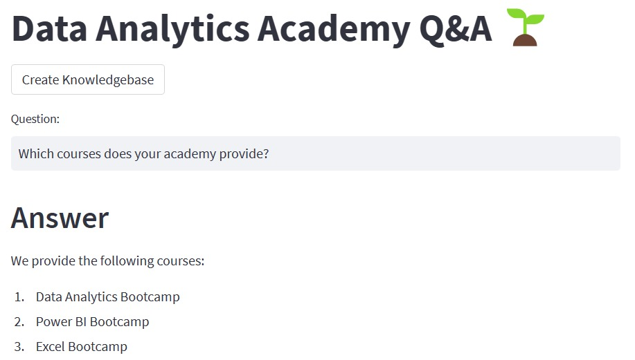
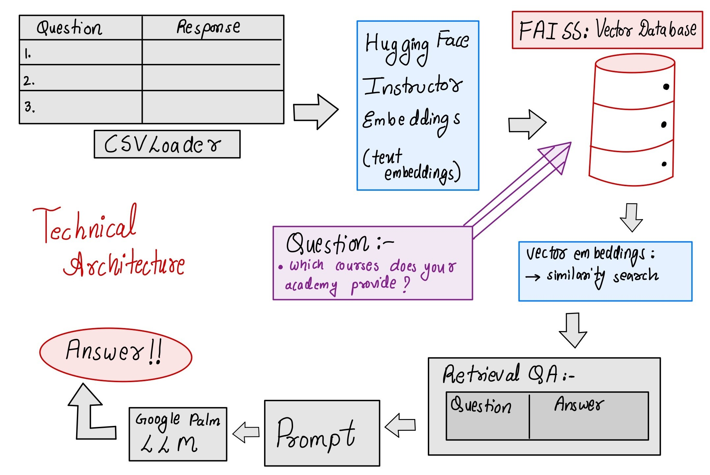

# Data Analytics Academy Q&A System

Welcome to the Data Analytics Academy Q&A System, a project leveraging advanced technologies to enhance the learning experience for students enrolled in data-related courses and bootcamps. This end-to-end project is based on Google Palm LLM (Large Language Model) and Langchain, designed to create a seamless question and answer (Q&A) platform.

## Project Overview

### Objective
The primary goal of this project is to develop a robust Q&A system that empowers students to ask questions and receive prompt answers, reducing the workload on human staff and enhancing the overall learning experience.

### Tech Stack Used
1. Google Palm LLM and Langchain: Integration of Google Palm LLM for language understanding and processing through Langchain.

2. Streamlit: Utilized to create an intuitive user interface (UI) for students to interact with the Q&A system seamlessly.

3. Hugging Face Instructor Embeddings: Implementation of text embeddings to enhance the understanding and contextual analysis of questions.

4. FAISS: Integration of Facebook AI Similarity Search for efficient vector database operations, contributing to faster retrieval of relevant information.

### Technical Architecture 

## Project Highlights:

1. CSV Integration: Utilizes a real CSV file with FAQs from Codebasics as a knowledge base.

2. Human Staff Support: Aids human staff in assisting course learners by leveraging the FAQ CSV file, streamlining support.

3. LLM-Based Q&A: Core functionality relies on Langchain and Google Palm's LLM for precise and quick responses.

4. Interactive Streamlit UI: Empowers students to ask questions directly and receive instant answers, fostering a dynamic learning environment.

## Usage
- Execute the Streamlit app: streamlit run main.py
- The web app will open in your browser, providing an interface to interact with the Q&A system.

## Sample Questions
Explore the system by asking questions like:

- "Do you guys provide internship, and do you offer EMI payments?"
- "Do you have a JavaScript course?"
- "Should I learn Power BI or Tableau?"
- "Can I use Power BI on my MAC computer?"
- "How can I enable Power Pivot if I don't see it?"

## Project Structure

- main.py: The main script for the Streamlit application.
- langchain_helper.py: Houses the code related to Langchain integration.
- requirements.txt: A list of required Python packages for seamless execution.
- .env: Configuration file for storing the Google API key.

Inspired by: @codebasics.io
